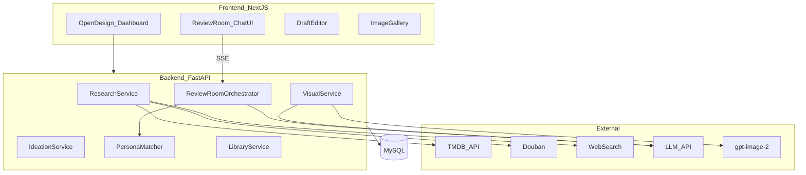
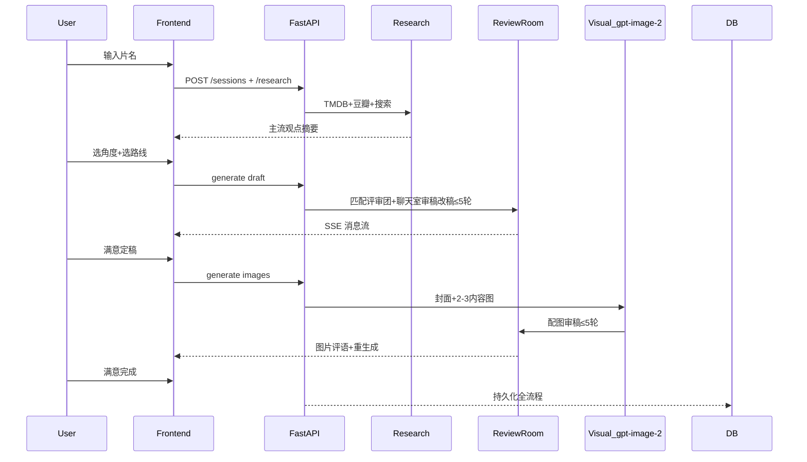

# SPEC.md — 片语 RedNote

> 经典电影小红书创作助手 · 规约文档 v1.0  
> 状态：**已签字确认**（2026-06-12）→ 已进入 writing-plans

---

## 1. 问题陈述

### 1.1 要解决什么问题？

个人经典电影博主在小红书发布**思想向影评**时，面临四类痛点：

1. **调研费时**：需查阅豆瓣、影评、解读文章，才能把握主流观点与可写角度。  
2. **角度难选**：资料繁杂，难以判断哪个主题既深刻又不俗套。  
3. **成稿质量不稳**：通用 AI 一键生成常出现**缺乏新意、AI 感重、标题与标签不吸引**等问题（用户已在大模型联网搜索场景下验证过此痛点）。  
4. **视觉生产门槛高**：优质笔记需要风格统一的**封面 + 内页配图**（金句卡、氛围图），个人博主难以完成图像 prompt 设计与迭代。

### 1.2 目标用户

**个人经典电影小红书博主**（自用，非工作室批量账号）。用户追求：

- 内容：**思想与主题讨论**，非剧情复述；  
- 表达：小红书网感（标题、hook、标签）；  
- 视觉：与影片气质匹配的封面与内容图；  
- 过程：可参与、可回放、可迭代的 **AI 协作创作**，而非黑盒一次性输出。

### 1.3 为什么值得做？（30 秒电梯演讲）

> 「片语 RedNote」让你只输入一部经典电影片名，就能在**聊天室式审稿团**陪伴下，完成从调研、选题、写稿到配图的全流程；多位 MBTI × 年龄段审稿智能体会像真实读者一样讨论你的稿子与图片，直到你满意——最终得到可直接发小红书的**深度影评文案 + 封面 + 2–3 张内容图**。

### 1.4 产品边界（明确不做）

- 不做剧集追更、不做多租户团队协作、不做自动发布到小红书、不做真实电影剧照抓取（版权风险）。  
- 不做未授权爬取小红书用户 prompt；视觉风格来自 **curated 提示词风格库**。

---

## 2. 用户故事（INVEST）

| ID | 用户故事 | 验收要点 |
|----|----------|----------|
| US1 | 作为博主，我只输入**经典电影片名**，系统返回影片元数据与**主流观点摘要** | 片名歧义时可确认；摘要标注来源类型（API/搜索） |
| US2 | 作为博主，我从 **3–5 个主题切入点** 中选择其一，用于思想向论述 | 切入点非剧情梗概 |
| US3 | 作为博主，我预览 **2 套不同论述路线** 并选定其一 | 两套路线的论证结构明显不同 |
| US4 | 作为博主，我在 **Review Room 聊天室** 中观看多元审稿团（3–5 人）评稿，并循环改稿直至满意 | 审稿与改稿均在聊天室；**文案审稿 ≤5 轮**；消息持久化可回放 |
| US5 | 作为博主，定稿后系统生成 **1 封面 + 2–3 张内容图**，且**配图同样在 Review Room 接受审稿团评审** | 使用 **gpt-image-2**；**配图审稿 ≤5 轮** |
| US6 | 作为博主，我可对标题/hook/正文/标签进行**分段重写、去 AI 感润色、手动编辑** | 改动产生新版本并记入时间线 |
| US7 | 作为博主，我查看**全部创作历史**，并可**收藏 / 标记已发布** | 支持按片名、时间、状态筛选 |
| US8 | 作为博主，审稿团**根据电影气质自动匹配**，而非随机无关人格 | 不同 genre 的影片匹配 panel 应有可解释差异 |

---

## 3. 功能规约（按模块）

### 3.1 M1 — Research（调研）

| 项 | 规约 |
|----|------|
| **输入** | 片名（中文或英文）；可选：年份/导演用于消歧 |
| **行为** | 调用 TMDB + 豆瓣（可用接口）获取元数据；联网搜索并过滤、去重、摘要「主流观点」 |
| **输出** | `MovieMeta` + `ResearchSnapshot`（≥3 条观点摘要，每条含来源类型） |
| **边界** | 单部片调研超时 60s；失败时返回部分结果 + 明确错误 |
| **错误处理** | 片名未找到 → 建议候选列表；搜索无结果 → 仅依赖 API 元数据 + LLM 知识并标注置信度 |

### 3.2 M2 — Ideation（选题）

| 项 | 规约 |
|----|------|
| **输入** | `CreationSession` 已完成调研 |
| **行为** | 生成 3–5 个**主题切入点**；用户选定后生成 **2 套论述路线** |
| **输出** | `selected_angle`；`selected_route`（含论点结构大纲） |
| **边界** | 切入点必须可导向「思想/主题」讨论 |
| **错误处理** | 生成不足 3 个切入点 → 重试 1 次；仍失败 → 报错并记录 AuditLog |

### 3.3 M3 — Copywriting + Review Room（成文与聊天室审稿）

Review Room 是**文案审稿与改稿的唯一界面**。

#### 3.3.1 评审团（Persona Library）

- **人格库规模**：16 MBTI × 5 年龄段（20s / 30s / 40s / 50s / 60s+）= **80 个预设审稿智能体**。  
- **单次激活**：**3–5 人**，由 **PersonaMatcher** 根据影片 genre、年代、国家、美学标签、用户选定主题角度自动匹配。  
- **每个 agent 属性**：`mbti`、`age_band`、`nickname`、`avatar_url`、`taste_profile`（审稿偏好文本）。  
- **次要能力（非阻塞 MVP+）**：用户「换一批评审团」；保存默认评审团。

#### 3.3.2 聊天室消息类型

| role | 说明 |
|------|------|
| `reviewer` | 某审稿 agent 的拟人化评语（含头像） |
| `moderator` | 汇总改稿指令 |
| `writer` | 发布修改稿摘要 / 完整稿（长文可折叠） |
| `user` | 用户插话或 @agent |
| `system` | 阶段切换、轮次提示 |

#### 3.3.3 文案审稿循环

```text
生成初稿 → [审稿团并行评语 → Moderator 汇总 → Writer 改稿] × N
N ≤ 5（硬上限）
用户可随时点击「满意，进入配图」终止循环
```

| 项 | 规约 |
|----|------|
| **输入** | 选定路线 + 匹配好的评审团 |
| **输出** | `DraftVersion`（title, hooks[2-3], body, tags[≥5]） |
| **审稿维度** | 思想深度、新意、反 AI 感、标题吸引力、标签网感、小红书可读性 |
| **边界** | 标签禁止仅输出 `#经典电影 #深度影评` 等泛化堆砌 |
| **错误处理** | 第 5 轮仍不达标 → 提示用户手动定稿或换评审团 |

#### 3.3.4 改稿能力（聊天室外围 API，结果回写聊天室）

- `regenerate` 分段：title / hooks / body / tags  
- `de-ai-polish`：按 anti-slop checklist 润色  
- `manual patch`：用户编辑器保存 → Writer 在聊天室发「用户已手动修改 vX」

### 3.4 M4 — Visual（配图生成与审稿）

定稿文案后进入配图阶段；**配图同样在 Review Room 审稿**。

#### 3.4.1 输出图片（固定 3–4 张）

| type | 数量 | 说明 |
|------|------|------|
| `cover` | 1 | 封面海报：片名 + 氛围视觉 |
| `quote_card` | 1 | 金句卡片：从正文提炼最有力一句 |
| `mood_shot` | 1 | 氛围镜头图：AI 电影感画面（**非真实剧照**） |
| `theme_visual` | 0–1 | 主题视觉/关键词排版（与 mood_shot 二选一或同时，由系统决定） |

**合计**：至少 **3 张**（1 封面 + 2 内容图），最多 **4 张**。

#### 3.4.2 图像模型

- **强制使用 OpenAI Images API 模型 `gpt-image-2`**。  
- 若实现时 API 名称有变，使用 OpenAI 官方最新的 **gpt-image 系列 2.x**，并在 README 注明实际 model id。  
- 风格路由：与 M1 元数据 + 选定主题角度 → 选择 curated 提示词模板（借鉴小红书常见影视笔记美学，**非爬取**）。

#### 3.4.3 配图审稿循环

```text
批量生成 3–4 张 → [审稿团对每张/整体评 → Moderator 汇总 → Visual Agent 重生成指定图] × N
N ≤ 5（硬上限，独立于文案轮次计数）
用户点击「满意，完成创作」终止
```

| 审稿维度 | 说明 |
|----------|------|
| 风格匹配 | 与影片 genre/时代气质一致 |
| 金句准确 | quote_card 文字与正文一致 |
| 小红书审美 | 是否像优质影视笔记内页 |
| 图文一致 | 视觉与选定主题角度不冲突 |
| 封面吸引力 | 首图是否有点击欲 |

| 项 | 规约 |
|----|------|
| **输入** | 定稿 `DraftVersion` + 评审团 |
| **输出** | `ImageAsset[]` + Review Room 消息流 |
| **边界** | 单张生成失败可单独重试，不影响其他张 |
| **错误处理** | gpt-image-2 限流 → 指数退避重试 2 次；失败写入 AuditLog |

### 3.5 M5 — Library（历史与回放）

| 项 | 规约 |
|----|------|
| **输入** | 用户操作 / session id |
| **行为** | 列表、筛选（favorite/published）、打开详情 **全流程回放** |
| **输出** | 时间线：调研 → 选题 → 聊天消息 → 草稿版本 → 图片版本 |
| **边界** | 完整历史保留，不做「仅最近 N 条」限制 |
| **错误处理** | 删除会话（软删）可选；默认不自动清理 |

### 3.6 持久化（硬性）

以下数据**必须**写入数据库，服务重启不丢失：

- `CreationSession`、`MovieMeta`、`ResearchSnapshot`  
- `ReviewMessage`（聊天室每条消息）  
- `DraftVersion`（每次改稿版本）  
- `ImageAsset`（每轮配图）  
- `AuditLog`（stage、API 调用摘要、错误）  

---

## 4. 非功能性需求

| 类别 | 要求 |
|------|------|
| **性能** | 调研 P95 < 60s；单轮审稿（3–5 agents）P95 < 45s；3–4 张图并行生成 P95 < 120s |
| **轮次上限** | 文案审稿 **≤5 轮**；配图审稿 **≤5 轮**（各自独立计数） |
| **安全** | 所有 API Key 仅服务端；`.env` 不入库；单用户简易鉴权（JWT 或 API Key）防公网滥用 |
| **可用性** | Review Room 支持 SSE 流式消息；长稿/长评折叠 |
| **可观测性** | 每请求 `trace_id`；AuditLog 记录 stage 与异常栈；不记录完整用户正文到第三方日志 |
| **成本** | README 说明 LLM + gpt-image-2 配额；开发环境支持 mock |
| **合规** | 不爬小红书；内容图不为 copyrighted 剧照 |
| **测试** | `make test` 一键运行；CI 每次 push 跑测试 + Docker build |

---

## 5. 系统架构

### 5.1 组件图



### 5.2 数据流（主路径）



### 5.3 外部依赖

| 依赖 | 用途 | 必需 |
|------|------|------|
| TMDB API | 影片元数据 | 是 |
| 豆瓣 | 中文评分/部分 metadata | 尽力 |
| 联网搜索 | 主流观点摘要 | 是 |
| OpenAI 兼容 LLM | 生成、审稿、改稿 | 是 |
| **gpt-image-2** | 封面 + 内容图 | 是 |
| MySQL 8 | 持久化（用户、会话、聊天、版本、图片元数据） | 是 |

---

## 6. 数据模型

### 6.1 实体摘要

**User**

| 字段 | 类型 | 说明 |
|------|------|------|
| id | UUID | PK |
| email / name | string | 简易账号 |
| default_reviewer_ids | JSON | 可选默认评审团 |

**ReviewerPersona**（种子数据 80 条）

| 字段 | 类型 | 说明 |
|------|------|------|
| id | UUID | PK |
| mbti | enum(16) | MBTI |
| age_band | enum | 20s/30s/40s/50s/60s+ |
| nickname | string | 显示名 |
| avatar_url | string | 头像 |
| taste_profile | JSON | 审稿偏好 |

**CreationSession**

| 字段 | 类型 | 说明 |
|------|------|------|
| id | UUID | PK |
| user_id | UUID | FK |
| movie_title | string | 输入片名 |
| status | enum | 见状态机 |
| selected_angle | JSON | 选定主题 |
| selected_route | JSON | 选定路线 |
| reviewer_panel_ids | JSON | 本次评审团 |
| text_review_round | int | 文案审稿轮次，max 5 |
| image_review_round | int | 配图审稿轮次，max 5 |
| is_favorite | bool | 收藏 |
| is_published | bool | 已发布 |
| created_at / updated_at | datetime | |

**状态机**：`created` → `researching` → `angles_ready` → `route_ready` → `drafting` → `text_reviewing` → `text_finalized` → `image_generating` → `image_reviewing` → `completed`

**ReviewMessage**

| 字段 | 类型 | 说明 |
|------|------|------|
| id | UUID | PK |
| session_id | UUID | FK |
| phase | enum | `text` / `image` |
| round | int | 轮次 |
| role | enum | reviewer/moderator/writer/user/system |
| persona_id | UUID? | FK，审稿 agent |
| content | text | 消息正文 |
| scores | JSON? | 可选打分 |
| attachment | JSON? | 图片审稿时附 image_id |
| created_at | datetime | |

**DraftVersion**

| 字段 | 类型 | 说明 |
|------|------|------|
| id | UUID | PK |
| session_id | UUID | FK |
| version | int | 递增 |
| title | string | |
| hooks | JSON | 2–3 条 |
| body | text | |
| tags | JSON | ≥5 个 |
| review_round | int | 对应文案轮次 |

**ImageAsset**

| 字段 | 类型 | 说明 |
|------|------|------|
| id | UUID | PK |
| session_id | UUID | FK |
| type | enum | cover/quote_card/mood_shot/theme_visual |
| url | string | 存储路径 |
| prompt | text | gpt-image-2 prompt |
| style_key | string | 风格模板 id |
| version | int | 重生成版本 |
| review_round | int | 对应配图轮次 |

**AuditLog** — stage、trace_id、event、payload 摘要、error

---

## 7. API 设计

Base URL: `/api/v1`

### 7.0 脚手架与健康检查（T1 Bootstrap）

| 方法 | 路径 | 说明 | 返回 |
|------|------|------|------|
| GET | `/health` | 服务存活探测（Docker/CI/Railway 用） | `200 {"status":"ok"}` |

> 业务 API 均在 `/api/v1` 下；`/health` 位于根路径，便于负载均衡与 compose healthcheck。

### 7.1 会话与调研

| 方法 | 路径 | 说明 |
|------|------|------|
| POST | `/sessions` | `{ "title": "肖申克的救赎", "year?": 1994 }` |
| POST | `/sessions/{id}/research` | 触发调研 |
| GET | `/sessions/{id}/research` | 获取摘要 |

### 7.2 选题

| 方法 | 路径 | 说明 |
|------|------|------|
| POST | `/sessions/{id}/angles/generate` | 生成切入点 |
| POST | `/sessions/{id}/angles/select` | `{ "angle_id": "..." }` |
| POST | `/sessions/{id}/routes/generate` | 生成 2 套路线 |
| POST | `/sessions/{id}/routes/select` | `{ "route_id": "..." }` |

### 7.3 评审团

| 方法 | 路径 | 说明 |
|------|------|------|
| POST | `/sessions/{id}/reviewers/match` | 按电影匹配 3–5 人 |
| POST | `/sessions/{id}/reviewers/reshuffle` | 换一批 |
| GET | `/personas` | 80 人格库 |

### 7.4 Review Room（文案）

| 方法 | 路径 | 说明 |
|------|------|------|
| POST | `/sessions/{id}/draft/generate` | 生成初稿并进入 text_reviewing |
| GET | `/sessions/{id}/review/stream?phase=text` | **SSE** 聊天流 |
| POST | `/sessions/{id}/review/continue` | 继续优化（下一轮，≤5） |
| POST | `/sessions/{id}/review/finalize-text` | 满意，进入配图 |
| POST | `/sessions/{id}/draft/regenerate` | `{ "part": "title\|hooks\|body\|tags" }` |
| POST | `/sessions/{id}/draft/de-ai-polish` | 去 AI 感 |
| PATCH | `/sessions/{id}/draft` | 手动保存 |

**SSE 事件**：`reviewer_message` | `moderator_summary` | `writer_revision` | `round_complete` | `phase_complete` | `error`

### 7.5 Review Room（配图）

| 方法 | 路径 | 说明 |
|------|------|------|
| POST | `/sessions/{id}/images/generate` | gpt-image-2 生成 3–4 张 |
| GET | `/sessions/{id}/review/stream?phase=image` | **SSE** 配图审稿流 |
| POST | `/sessions/{id}/images/regenerate` | `{ "image_id": "...", "reason": "..." }` |
| POST | `/sessions/{id}/review/continue` | 配图继续优化（≤5） |
| POST | `/sessions/{id}/review/finalize` | 满意，完成创作 |

### 7.6 历史

| 方法 | 路径 | 说明 |
|------|------|------|
| GET | `/sessions` | `?favorite=&published=` |
| GET | `/sessions/{id}` | 详情 |
| GET | `/sessions/{id}/timeline` | 全流程回放 |
| PATCH | `/sessions/{id}` | `{ "is_favorite", "is_published" }` |

### 7.7 错误码

| code | HTTP | 说明 |
|------|------|------|
| `MOVIE_NOT_FOUND` | 404 | 片名无匹配 |
| `REVIEW_ROUND_LIMIT` | 429 | 已达 5 轮上限 |
| `IMAGE_GEN_FAILED` | 502 | gpt-image-2 失败 |
| `EXTERNAL_API_ERROR` | 502 | TMDB/搜索异常 |

---

## 8. 技术选型与理由

| 层级 | 选型 | 理由 |
|------|------|------|
| 后端 | **Python 3.12 + FastAPI** | AI/RAG 生态成熟；pytest 适合 TDD |
| 前端 | **Next.js 15 + TypeScript** | 课程推荐；SSE 聊天 UI 友好 |
| Open Design | **Linear 设计系统** + **dashboard** skill | 工具型创作台；Review Room 为 dashboard 内聊天面板 |
| Open Design 补充 | 图片画廊复用 dashboard 卡片布局 | 封面+内容图预览与下载 |
| LLM | OpenAI 兼容 API | 多 agent 审稿与改稿 |
| 图像 | **OpenAI Images `gpt-image-2`** | 用户指定；封面+内容图统一模型 |
| 影片数据 | TMDB + 豆瓣 + 联网搜索 | 方案 C，兼顾中文主流观点 |
| 数据库 | **MySQL 8**（docker-compose 侧车；本地开发连接同一 MySQL 实例） | 聊天与版本数据可靠持久化；ORM 使用 SQLAlchemy + Alembic 迁移 |
| 实时 | **SSE** | Review Room 流式推送 |
| 测试 | pytest + Vitest | 后端/前端 TDD |
| 容器 | Dockerfile + docker-compose | 课程硬性要求 |
| CI | GitHub Actions | test + docker build + 推 GHCR |
| 云部署 | Railway / Render | 公网 URL；Docker 一键部署 |

**Open Design 选择理由**：Linear 风格偏专业工具感，契合「创作工作台 + 聊天室协作」；dashboard skill 提供布局与组件范式，避免 AI slop 界面。

---

## 9. 验收标准

| ID | 功能 | 客观判定 |
|----|------|----------|
| AC1 | 调研 | 《肖申克的救赎》→ 返回年份/导演 + ≥3 条主流观点摘要 |
| AC2 | 选题 | ≥3 切入点 + 2 套可区分的论述路线 |
| AC3 | 评审团匹配 | 不同 genre 影片，panel 的 MBTI/age/taste 分布符合 PersonaMatcher 规则 |
| AC4 | 文案 Review Room | ≥3 条 reviewer 消息 + 1 moderator；**改稿消息也在聊天室**；**≤5 轮** |
| AC5 | 反 AI 感 | 内置水文样例测试：审稿应指出套话并触发改写 |
| AC6 | 成稿字段 | title + 2–3 hooks + body + ≥5 非泛化 tags |
| AC7 | 配图生成 | 定稿后生成 **≥3 张**（1 cover + 2 内容图），模型为 **gpt-image-2** |
| AC8 | 配图 Review Room | 审稿团对图片发评；可触发单张重生成；**≤5 轮** |
| AC9 | 持久化 | 重启后会话、ReviewMessage、DraftVersion、ImageAsset 完整保留 |
| AC10 | 回放 | timeline 可展示从调研到配图完成的全部消息与版本 |
| AC11 | 历史 | 完整列表 + favorite/published 标记 |
| AC12 | 测试与 CI | `make test` 通过；CI 绿 |

---

## 10. 风险与未决问题

| 风险 | 影响 | 应对 |
|------|------|------|
| 多 agent × 多轮审稿 **API 成本高** | 单篇笔记成本上升 | 文案/配图各 ≤5 轮；定稿后才生图；开发 mock |
| gpt-image-2 **限流/不可用** | 配图失败 | 重试 + AuditLog；README 文档化 model id |
| 联网搜索 **质量不稳定** | 主流观点不准 | API 元数据交叉验证；摘要标注来源 |
| 80 persona **prompt 维护复杂** | 审稿风格漂移 | JSON 种子 + 快照测试 |
| PersonaMatcher **规则过于简单** | 匹配不准 | 首版规则表 + 用户「换一批」 |
| 聊天消息 **UI 过载** | 体验差 | 按 round/phase 折叠；Moderator 置顶 |
| 版权 | 法律风险 | 禁止剧照；仅 AI 生成图 |
| Windows 开发差异 | 环境不一致 | Docker 为验收标准；CI Linux |

**未决问题（implementation 前确认）**：

1. 豆瓣 API 可用性：若不可用，是否仅用 TMDB + 搜索 + LLM？  
2. 图片存储：本地 volume vs S3 兼容对象存储（生产建议后者）。  
3. 单用户鉴权：JWT 注册 vs 单用户 API Key（MVP 可后者）。

---

## 附录 A — 完整用户流程

```text
1. 输入片名
2. 调研 → 主流观点摘要
3. 选主题切入点（3–5 选 1）
4. 选论述路线（2 选 1）
5. 生成初稿 → Review Room 文案审稿/改稿（≤5 轮，用户可提前定稿）
6. 生成封面 + 2–3 内容图（gpt-image-2）
7. Review Room 配图审稿/重生成（≤5 轮，用户可提前完成）
8. 保存历史，可收藏/标记已发布，可全流程回放
```

---

## 附录 B — 方案决策记录

| 决策 | 选择 | 来源 |
|------|------|------|
| 架构 | 分阶段 Pipeline（方案 A） | brainstorming Q8–Q9 |
| 资料源 | TMDB + 豆瓣 + 搜索 | 用户选 C |
| 审稿 | 80 persona 库，单次 3–5 人，电影匹配 | 用户确认 |
| 审稿 UI | Review Room 聊天室 | 用户确认 |
| 文案轮次 | ≤5 | 用户确认 |
| 配图 | 封面 + 2–3 内容图，亦经 Review Room，≤5 轮 | 用户确认 |
| 图像模型 | gpt-image-2 | 用户确认 |
| 历史 | 完整 + favorite/published | 用户确认 |

---

**文档状态**：待用户审阅签字。确认后进入 `writing-plans` → `PLAN.md` → 冷启动验证 → 实现。
